# KORA - Orchestrated Reasoning Agent
### Track 3: Unified Enterprise Conversational AI Agent Prototype
**Enterprise AI Research Case Study**

---
## Submission Deliverables

| # | Deliverable | Description | Link |
|---|---|---|---|
| 1 | **Working Model** | Source code, configuration, instructions, and scripts required to run the functional prototype. | [prototype](https://kohler-enterprise-intelligence.vercel.app/) |
| 2 | **Prompts Documentation (PDF)** | Comprehensive documentation containing all AI prompts, system instructions, agent workflows, and prompt engineering used in the solution. | [View Prompts Documentation](docs-deliverables/prompts.md) |
| 3 | **Video Demonstration** | 1–3 minute walkthrough demonstrating the working prototype and its key features. | [Watch Demo Video](YOUR_VIDEO_LINK_HERE) |
| 4 | **Presentation Deck (PDF)** | Maximum 4-slide presentation covering the core approach, system architecture, technology stack, and innovation pitch. | [View Presentation Deck](./docs-deliverables/pitch-deck) |


## 1. Executive Summary & Architecture

The **KORA - Orchestrated Reasoning Agent** is an enterprise-grade AI copilot prototype designed to resolve complex cross-departmental policy inquiries across five organizational domains:
1. **HR Policies** (Paid time off, hybrid work guidelines, executive severance)
2. **Financial Guidelines** (Travel per diems, flight cabin class rules, discretionary hospitality budgets)
3. **Customer Support** (Smart fixture warranties, defective parts replacement workflows)
4. **Data Privacy** (Customer PII protection, IoT telemetry safeguards, DPIA mandates)
5. **Legal & Compliance** (Vendor master agreements, DPA requirements, whistleblower hotline)

### Core Architectural Pillars

```mermaid
flowchart TD

subgraph group_runtime["Runtime and Entry"]
  node_app_server["Express/Vite Server<br/>application server"]
  node_spa_bootstrap["React SPA Bootstrap<br/>frontend entry"]
  node_app_controller["Copilot Application Controller<br/>frontend controller"]
end

subgraph group_ui["Copilot UI"]
  node_role_navigation["Role and Tab Navigation<br/>UI component"]
  node_chat_workspace["Chat Conversation Workspace<br/>UI component"]
  node_evidence_inspector["Citation Evidence Inspector<br/>UI component"]
  node_approval_dialog["High-Risk Approval Dialog<br/>UI component"]
  node_trace_viewer["Agent Trace Viewer<br/>UI component"]
  node_knowledge_explorer["Knowledge Repository Explorer<br/>UI component"]
  node_audit_viewer["Audit Trail Viewer<br/>UI component"]
  node_benchmark_runner["Benchmark Runner<br/>evaluation UI"]
end

subgraph group_workflow["Agent Workflow and Governance"]
  node_workflow_planner["Agent Workflow Planner<br/>agent orchestrator"]
  node_retrieval_rbac["Policy Retrieval and RBAC<br/>retrieval and authorization service"]
  node_conflict_analyzer["Policy Conflict Analyzer<br/>policy analysis service"]
  node_confidence_verifier["Grounding and Confidence Verifier<br/>verification service"]
  node_artifact_formatter["Output Artifact Formatter<br/>output formatting service"]
  node_audit_logger["In-Memory Audit Logger<br/>audit service"]
end

subgraph group_data["Synthetic Data and Evaluation"]
  node_policy_repository[("Synthetic Policy Repository<br/>in-memory policy data")]
  node_employee_directory[("Synthetic Employee and Expense Directory<br/>in-memory directory data")]
  node_benchmark_catalog[("Benchmark Scenario Catalog<br/>evaluation data")]
end

subgraph group_external["External Systems"]
  node_browser_user(("Browser User<br/>external actor"))
  node_gemini_api(("Google Gemini API<br/>external inference provider"))
end

node_browser_user -->|"requests SPA/API"| node_app_server
node_browser_user -->|"executes bundle"| node_spa_bootstrap
node_spa_bootstrap -->|"renders App"| node_app_controller
node_browser_user -->|"submits queries"| node_app_controller
node_app_controller -->|"executes workflow"| node_workflow_planner
node_workflow_planner -->|"returns plan"| node_app_controller
node_app_controller -->|"supplies conversation"| node_chat_workspace
node_app_controller -->|"supplies trace"| node_trace_viewer
node_app_controller -->|"maintains citation"| node_evidence_inspector
node_app_controller -->|"maintains approval"| node_approval_dialog
node_app_controller -->|"writes audit event"| node_audit_logger
node_audit_viewer -->|"reads records"| node_audit_logger
node_benchmark_catalog -->|"supplies cases"| node_benchmark_runner
node_benchmark_runner -->|"executes cases"| node_workflow_planner
node_retrieval_rbac -->|"reads and scores"| node_policy_repository
node_workflow_planner -->|"routes retrieval"| node_retrieval_rbac
node_workflow_planner -->|"checks conflicts"| node_conflict_analyzer
node_workflow_planner -->|"verifies grounding"| node_confidence_verifier
node_workflow_planner -->|"formats output"| node_artifact_formatter
node_workflow_planner -->|"uses lookup tools"| node_employee_directory
node_app_controller -.->|"requests Gemini proxy"| node_app_server
node_app_server -.->|"generates content"| node_gemini_api

click node_app_server "https://github.com/mahek-technophile/kohler-project/blob/main/server.ts"
click node_spa_bootstrap "https://github.com/mahek-technophile/kohler-project/blob/main/src/main.tsx"
click node_app_controller "https://github.com/mahek-technophile/kohler-project/blob/main/src/App.tsx"
click node_role_navigation "https://github.com/mahek-technophile/kohler-project/blob/main/src/components/Header.tsx"
click node_chat_workspace "https://github.com/mahek-technophile/kohler-project/blob/main/src/components/ChatView.tsx"
click node_evidence_inspector "https://github.com/mahek-technophile/kohler-project/blob/main/src/components/EvidenceDrawer.tsx"
click node_approval_dialog "https://github.com/mahek-technophile/kohler-project/blob/main/src/components/HitlApprovalModal.tsx"
click node_trace_viewer "https://github.com/mahek-technophile/kohler-project/blob/main/src/components/AgentTraceView.tsx"
click node_knowledge_explorer "https://github.com/mahek-technophile/kohler-project/blob/main/src/components/KnowledgeBaseView.tsx"
click node_audit_viewer "https://github.com/mahek-technophile/kohler-project/blob/main/src/components/AuditLogView.tsx"
click node_benchmark_runner "https://github.com/mahek-technophile/kohler-project/blob/main/src/components/BenchmarkView.tsx"
click node_workflow_planner "https://github.com/mahek-technophile/kohler-project/blob/main/src/services/agentPlanner.ts"
click node_retrieval_rbac "https://github.com/mahek-technophile/kohler-project/blob/main/src/services/ragEngine.ts"
click node_conflict_analyzer "https://github.com/mahek-technophile/kohler-project/blob/main/src/services/conflictDetector.ts"
click node_confidence_verifier "https://github.com/mahek-technophile/kohler-project/blob/main/src/services/verificationEngine.ts"
click node_artifact_formatter "https://github.com/mahek-technophile/kohler-project/blob/main/src/services/outputFormatters.ts"
click node_audit_logger "https://github.com/mahek-technophile/kohler-project/blob/main/src/services/auditLogger.ts"
click node_policy_repository "https://github.com/mahek-technophile/kohler-project/blob/main/src/data/syntheticKnowledgeBase.ts"
click node_employee_directory "https://github.com/mahek-technophile/kohler-project/blob/main/src/data/employeeDirectory.ts"
click node_benchmark_catalog "https://github.com/mahek-technophile/kohler-project/blob/main/src/data/evaluationBenchmark.ts"

classDef toneNeutral fill:#f8fafc,stroke:#334155,stroke-width:1.5px,color:#0f172a
classDef toneBlue fill:#dbeafe,stroke:#2563eb,stroke-width:1.5px,color:#172554
classDef toneAmber fill:#fef3c7,stroke:#d97706,stroke-width:1.5px,color:#78350f
classDef toneMint fill:#dcfce7,stroke:#16a34a,stroke-width:1.5px,color:#14532d
classDef toneRose fill:#ffe4e6,stroke:#e11d48,stroke-width:1.5px,color:#881337
classDef toneIndigo fill:#e0e7ff,stroke:#4f46e5,stroke-width:1.5px,color:#312e81
classDef toneTeal fill:#ccfbf1,stroke:#0f766e,stroke-width:1.5px,color:#134e4a
class node_app_server,node_spa_bootstrap,node_app_controller toneBlue
class node_role_navigation,node_chat_workspace,node_evidence_inspector,node_approval_dialog,node_trace_viewer,node_knowledge_explorer,node_audit_viewer,node_benchmark_runner toneAmber
class node_workflow_planner,node_retrieval_rbac,node_conflict_analyzer,node_confidence_verifier,node_artifact_formatter,node_audit_logger toneMint
class node_policy_repository,node_employee_directory,node_benchmark_catalog toneRose
class node_browser_user,node_gemini_api toneIndigo
```




```
+-----------------------------------------------------------------------------------+
|                           USER / BROWSER INTERACTION LAYER                        |
|   Role Selector (Lightning McQueen / Employee, Manager, HR, Finance, Legal, Admin) |
|   Query Bar + Format Selector (Standard Chat, Validated JSON, Excel .xlsx, Email) |
+-----------------------------------------------------------------------------------+
                                         |
                                         v
+-----------------------------------------------------------------------------------+
|                           REACT AGENT ORCHESTRATION LOOP                          |
|  1. Format Detection (Intent parsing for JSON schema, Excel download, Email draft) |
|  2. Multi-Domain Taxonomy Routing (HR, Finance, Support, Privacy, Legal)          |
|  3. Pre-Retrieval Deterministic RBAC Gate (Drops restricted chunks before prompt) |
|  4. Hybrid Retrieval & Temporal Relevance Scoring (Token-overlap + date scoring)  |
|  5. Policy Conflict & Supersession Analysis (Active vs Superseded metadata graph) |
|  6. Tool Execution (Employee Directory Lookup, Expense Audit, SheetJS XLSX Export)|
|  7. Grounded Answer Synthesis (Grounded in verified section citations)            |
|  8. Observable Confidence Calculation (Relevance + Authority + Recency + Conflict)|
|  9. Human-in-the-Loop (HITL) Gate for High-Risk External Actions                  |
| 10. Audit Logging (In-memory structured telemetry of every query & decision)       |
+-----------------------------------------------------------------------------------+
                                         |
                                         v
+-----------------------------------------------------------------------------------+
|                        SYNTHETIC REPOSITORY & TOOL LAYER                          |
|  - Synthetic Enterprise Policy Documents (5 domains, versioning, validity dates)   |
|  - Synthetic Employee Directory (Lightning McQueen, Sarah Jenkins, Elena Vance)   |
|  - In-Memory Regulatory Audit Log & Empirical Benchmark Runner (8 Scenarios)      |
+-----------------------------------------------------------------------------------+
```

---

## 2. Key Demo Scenarios (Scenarios 1 – 8)

The prototype includes an instant scenario launcher and a dedicated **Evaluation & KPIs** suite to test all case-study requirements with a single click:

| Scenario | Title | Active Role | Key Capabilities Demonstrated |
| :--- | :--- | :--- | :--- |
| **Demo 1** | Single-Domain Knowledge Grounding | `EMPLOYEE` | Grounded extraction of domestic travel per diem ($75/day cap, $25 receipt threshold, Section 3.2). |
| **Demo 2** | Cross-Department Governance Reasoning | `EMPLOYEE` | Multi-domain synthesis across Privacy (DPIA, encryption), Legal (DPA, SOC2 Type II), and Support (warranty scope) for external cloud vendor data sharing. |
| **Demo 3** | Deterministic RBAC Containment | `EMPLOYEE` vs `FINANCE` | When queried as `EMPLOYEE`, executive discretionary entertainment caps are dropped before retrieval with an Access Restricted notice. Switching role to `FINANCE` grants clearance. |
| **Demo 4** | Policy Conflict & Temporal Supersession | `EMPLOYEE` | Reconciles user query citing historical $50/day allowance by detecting that Policy v2.0 was superseded by active Policy v3.1 ($75/day, effective Jan 1, 2026). |
| **Demo 5** | Dynamic Validated JSON Generation | `EMPLOYEE` | Dynamically parses schema keys (`eligibility`, `per_diem_limits`, `cabin_class`, `approval_thresholds`) and outputs a validated JSON artifact. |
| **Demo 6** | Real Downloadable Excel (.xlsx) | `MANAGER` | Invokes employee directory lookup, cross-checks travel policies, flags over-cap expenditures, and generates a valid binary `.xlsx` spreadsheet using SheetJS. |
| **Demo 7** | Outbound Email Draft with Citations | `EMPLOYEE` | Drafts a formal flight cabin exception email to Corporate Procurement citing Section 4.1 (>8 hour flight to Tokyo). |
| **Demo 8** | Multi-Step Agentic Workflow & HITL | `LEGAL` | Multi-tool ReAct execution triggering a Human-in-the-Loop approval gate before dispatching high-risk external notices. |

---

## 3. Security & RBAC Clearance Matrix

The knowledge base implements a strict 6-tier Role-Based Access Control model evaluated **prior to LLM prompt assembly**:

| Role | Access Tier Description | Accessible Documents | Restricted Documents |
| :--- | :--- | :--- | :--- |
| **EMPLOYEE** | Standard Associate | Standard HR policies, general travel guidelines, customer warranty terms. | Executive severance, discretionary entertainment caps, legal whistleblower logs. |
| **MANAGER** | Department Manager | All employee-tier policies + team approval thresholds and department budgets. | Confidential executive compensation, CPO privacy assessments. |
| **HR** | HR Specialist | Full HR repository, confidential severance formulas, personnel relations. | Finance controller exception caps, legal attorney-client records. |
| **FINANCE** | Finance Auditor | Full travel and procurement policies, executive entertainment caps, treasury limits. | Confidential HR health records, privileged legal litigation files. |
| **LEGAL** | Legal & Compliance | DPA agreements, whistleblower hotlines, regulatory risk disclosures. | Unmasked employee compensation matrices. |
| **ADMIN** | Enterprise Superuser | Full access across all 5 departmental repositories. | None. |

---

## 4. Empirical Evaluation & KPI Scorecard

The prototype includes an automated benchmark runner that executes all 8 case study scenarios directly against live services and calculates actual measured telemetry:

### 1. Measured Metrics (Computed Live from Executed Scenarios)
* **Assertions Passed**: Measured live across all 8 test cases (RBAC containment, ground truth citations, conflict identification, format validity).
* **Average Retrieval & Synthesis Latency**: Measured live in milliseconds via `performance.now()`.
* **RBAC Containment**: Evaluates that 100% of restricted documents (e.g., Scenario 3) are filtered pre-retrieval.
* **Structured Output Validity**: 100% of requested JSON, Excel, and Email artifacts validate against structural schemas.

### 2. Estimated Metrics (Explicitly Labeled Prototype Estimates)
* **Operational Search Reduction**: ~1.8 hours per complex cross-departmental query.
  * *Disclaimer*: **Prototype estimate — not an empirical enterprise measurement.** Based on manual workflow modeling comparing manual cross-referencing of 5 departmental repositories (HR, Finance, Privacy, Legal, Customer Support) against unified agent retrieval.

### 3. Unmeasured / Production-Only Metrics
* **Statistical Hallucination Rate at Enterprise Scale**: Labeled as **N/A — Not measured**. Production-scale hallucination rates require longitudinal human auditing across thousands of real production documents.
* **Enterprise Token Overhead**: Labeled as **N/A — Not measured**.

---

## 5. Technology Stack & Architectural Decisions

* **Frontend**: React 19, TypeScript, Tailwind CSS, Lucide React Icons, SheetJS (`xlsx`)
* **Backend**: Express (Node.js), Vite Development Middleware, `@google/genai` (Gemini model integration with deterministic fallback)
* **Storage & Telemetry**: In-memory compliance audit service, synthetic enterprise policy repository across 5 domains.
* **Architecture Style**: Client-side single-page copilot with server-side proxy capabilities, prioritizing working code, explainability, and technical defensibility.

---

## 6. Project Directory Structure

```
├── README.md                      # Primary project overview & architecture
├── docs/
│   ├── technical-report.md        # Comprehensive 10-section technical whitepaper
│   ├── user-guide.md              # Operator guide for testing the prototype
│   ├── prompts.md                 # System prompts, guardrails, and templates
│   ├── presentation.md            # 4-slide executive presentation script
│   ├── demo-script.md             # 2-minute live presentation walkthrough
│   └── submission-checklist.md    # Case study Track 3 requirement verification
├── src/
│   ├── components/                # Modular React views (Chat, Trace, Audit, Benchmark, KB)
│   ├── data/                      # Synthetic knowledge base, employee directory, benchmarks
│   ├── services/                  # Agent planner, RAG engine, conflict detector, formatters
│   └── types/                     # Enterprise TypeScript interfaces & enums
```

---

## 7. Synthetic Data Notice

> **Synthetic demonstration data prepared for Enterprise AI Research Case Study. Not official corporate documentation.** All policy numbers, dollar caps, approval thresholds, and employee names (e.g., Lightning McQueen) are fictional assets constructed specifically to demonstrate governance reasoning.
